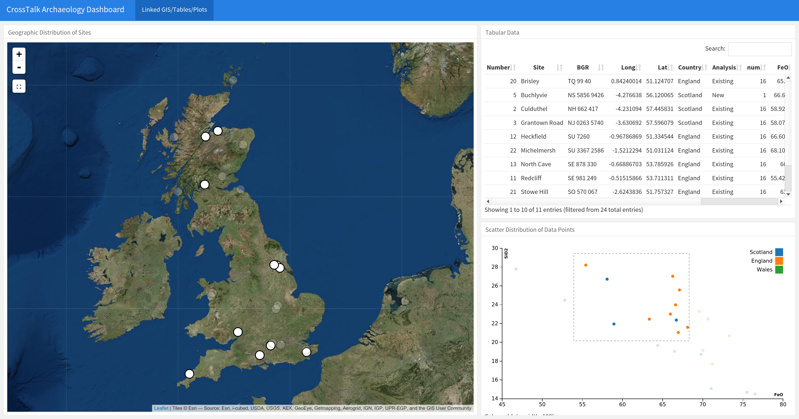

# CrossTalk-Archaeology-Dashboard

This `flexdashboard` is desgined for relational/GIS archaeological data to be simultaneously viewed in `leaflet`, `DT` and `d3scatter` for quick and easy exploratory analysis. It uses synthetic data from Stetkiewicz, S., (2016). *Iron Age Iron Production in Britain and the Near Continent: Compositional Analyses and Smelting "Systems"*. Unpublished PhD Thesis, University of Edinburgh.

# Use

There are three ways to reactively select data points:

1. Click the small box below the zoom option on the `leaflet` map to select sites
2. Select rows or columns of data from the `DT` datatable 
3. Click and drag to highlight desired sites on the `d3scatter` scatterplot.

# Updates

This repostory will be updated soon to provide reactive infoBoxes/valueBoxes and gauge elements
